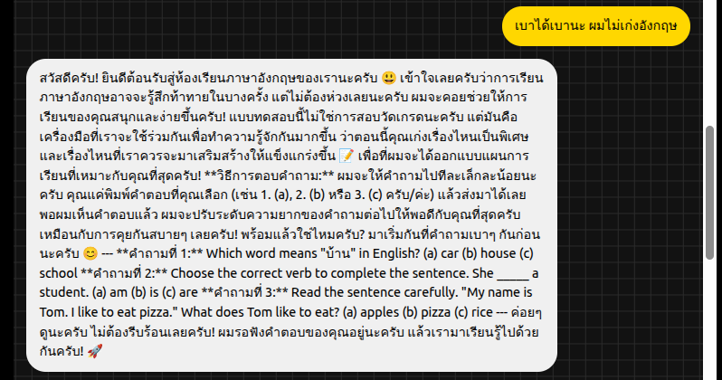
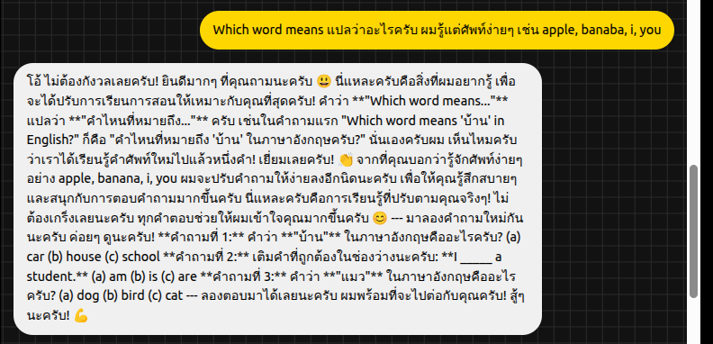
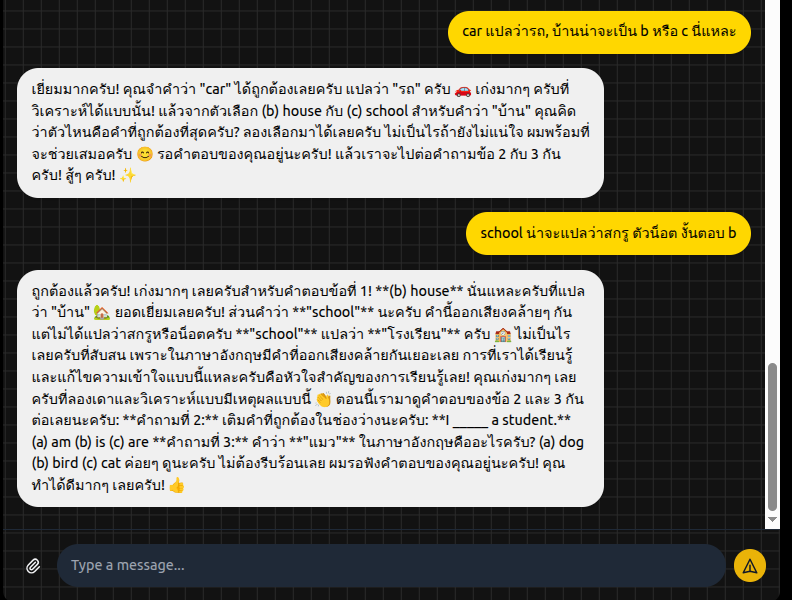
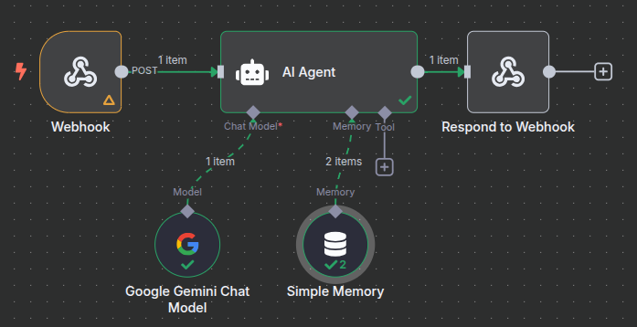

# ซอร์สโค้ดนี้ ใช้สำหรับเป็นตัวอย่างเท่านั้น ถ้านำไปใช้งานจริง ผู้ใช้ต้องจัดการเรื่องความปลอดภัย และ ประสิทธิภาพด้วยตัวเอง

# Word Flow

Word Flow is an AI-powered English placement test designed for Thai speakers. It provides an interactive and adaptive learning experience through a user-friendly chat interface. The application assesses the user's English proficiency and delivers a personalized study plan based on their performance.

## How It Works

The application consists of three main components:

1.  **Frontend**: A static web page built with HTML and Tailwind CSS that provides the chat interface. It communicates with the backend server to send and receive messages.
2.  **Backend**: A Node.js server using Express that serves the frontend and forwards chat messages to an n8n webhook.
3.  **n8n Workflow**: A powerful workflow that receives messages from the backend, processes them using an AI model (guided by a detailed system prompt), and sends the response back.

The core of the application is the n8n workflow, which uses a sophisticated system prompt to create an adaptive and personalized English placement test. The prompt instructs the AI to act as a friendly English tutor, adjusting the difficulty of questions based on the user's answers and providing a detailed analysis in Thai.

## Screenshots

### Chat Interface




### n8n Workflow


## Getting Started

To run this project locally, follow these steps:

### Prerequisites

*   Node.js and npm installed
*   An active n8n instance

### Installation

1.  **Clone the repository:**
    ```bash
    git clone <repository-url>
    ```

2.  **Navigate to the server directory and install dependencies:**
    ```bash
    cd server
    npm install
    ```

3.  **Configure the n8n workflow:**
    *   Create workflow into your n8n instance.
    *   Update the webhook URL in `server/index.js` to match the one provided by your n8n workflow.

### Running the Application

1.  **Start the backend server:**
    ```bash
    npm start
    ```
    The server will be running at `http://localhost:3000`.

2.  **Open your browser and navigate to `http://localhost:3000` to access the chat interface.**

## Key Files

*   `src/index.html`: The main frontend file containing the chat UI and client-side logic.
*   `server/index.js`: The backend server that connects the frontend to the n8n workflow.
*   `system-prompt-02.md`: The system prompt that guides the AI's behavior, ensuring a personalized and effective learning experience.
